# 🍔 BiteFast — Modern Food Delivery & Live Tracking

> **Enterprise-Grade, Offline-First, Secure Android Native Application built with Jetpack Compose, Clean Architecture, and Unidirectional Data Flow (MVI).**

[](https://kotlinlang.org)
[](https://developer.android.com/jetpack/compose)
[](https://developer.android.com)
[](https://developer.android.com/training/dependency-injection/hilt-android)
[](https://owasp.org)
[](https://www.w3.org/WAI/standards-guidelines/wcag/)
[](LICENSE)

---

## 🌟 Executive Overview

**BiteFast** is a production-ready, enterprise-standard Android food delivery platform designed from the ground up for high reliability, bank-grade security, and accessible user experience. 

Engineered with **Strict Clean Architecture**, the project separates concerns into fully decoupled modules where domain business logic remains 100% pure Kotlin JVM with zero Android SDK dependencies. The presentation layer leverages **Jetpack Compose Material 3** with a reactive **MVI / UDF** paradigm, while the data layer enforces an **Offline-First** single source of truth powered by encrypted Room SQLite and AES-256 GCM DataStore.

---

## 🏛️ System Architecture

BiteFast strictly complies with **Clean Architecture** and **Unidirectional Data Flow (MVI / UDF)**:

```
┌────────────────────────────────────────────────────────────────────────┐
│                      PRESENTATION LAYER (UI + MVI)                     │
│  • Jetpack Compose M3          • Custom Shimmer Skeletons              │
│  • Stateless Screen Composables • TalkBack Accessible Semantics         │
│  • BaseViewModel: StateFlow<UiState> + Channel<UiEffect>               │
└───────────────────────────────────┬────────────────────────────────────┘
                                    │ Observes State & Dispatches Events
                                    ▼
┌────────────────────────────────────────────────────────────────────────┐
│               DOMAIN LAYER (Pure Kotlin JVM - Zero Android)            │
│  • 35+ UseCases (Single Responsibility Principle)                      │
│  • Domain Business Models & Value Objects                              │
│  • Repository Interfaces (Inversion of Control)                        │
└───────────────────────────────────▲────────────────────────────────────┘
                                    │ Implements Contracts
                                    │
┌───────────────────────────────────┴────────────────────────────────────┐
│                    DATA LAYER (Single Source of Truth)                 │
│  • Mutex-protected Repositories against race-conditions               │
│  • Bidirectional Mappers: NetworkDTO ↔ DBEntity ↔ DomainModel          │
│  ┌─────────────────────────────────┬─────────────────────────────────┐ │
│  │     Local Encrypted Storage     │       Remote API Services       │ │
│  │  • SQLCipher AES-256 Room DB    │  • Retrofit 2.11 + OkHttp 4     │ │
│  │  • Encrypted DataStore AES-GCM  │  • Certificate Pinning (SPKI)   │ │
│  │  • Biometric Keystore MasterKey │  • Real-time WebSocket Client   │ │
│  └─────────────────────────────────┴─────────────────────────────────┘ │
└────────────────────────────────────────────────────────────────────────┘
```

### Module Dependency Direction (Strictly Enforced)

```mermaid
graph TD
    App[":app"] --> FeatureDiscovery[":feature:discovery"]
    App --> FeatureDetail[":feature:detail"]
    App --> FeatureCart[":feature:cart"]
    App --> FeatureCheckout[":feature:checkout"]
    App --> FeatureOrder[":feature:order"]
    App --> FeatureTracking[":feature:tracking"]
    App --> FeatureRating[":feature:rating"]
    App --> FeatureNotification[":feature:notification"]
    App --> FeatureVoucher[":feature:voucher"]
    App --> FeatureProfile[":feature:profile"]
    App --> FeatureAuth[":feature:auth"]

    FeatureDiscovery & FeatureDetail & FeatureCart & FeatureCheckout & FeatureOrder & FeatureTracking & FeatureRating & FeatureNotification & FeatureVoucher & FeatureProfile & FeatureAuth --> CoreDomain[":core:domain"]
    FeatureDiscovery & FeatureDetail & FeatureCart & FeatureCheckout & FeatureOrder & FeatureTracking & FeatureRating & FeatureNotification & FeatureVoucher & FeatureProfile & FeatureAuth --> CoreDesignSystem[":core:designsystem"]
    FeatureDiscovery & FeatureDetail & FeatureCart & FeatureCheckout & FeatureOrder & FeatureTracking & FeatureRating & FeatureNotification & FeatureVoucher & FeatureProfile & FeatureAuth --> CoreModel[":core:model"]
    FeatureDiscovery & FeatureDetail & FeatureCart & FeatureCheckout & FeatureOrder & FeatureTracking & FeatureRating & FeatureNotification & FeatureVoucher & FeatureProfile & FeatureAuth --> CoreCommon[":core:common"]

    CoreData[":core:data"] --> CoreDomain
    CoreData --> CoreDatabase[":core:database"]
    CoreData --> CoreNetwork[":core:network"]
    CoreData --> CoreDataStore[":core:datastore"]
    CoreData --> CoreModel
```



> [!IMPORTANT]
> **Zero Cross-Feature Coupling:** Feature modules NEVER depend on each other (`:feature:cart` does NOT depend on `:feature:discovery`). Navigation between features is orchestrated centrally at `:app` via route destinations.

---

## 📁 Repository Directory Structure

The project is structured into **18 Gradle modules** organized by layer and feature:

```
BiteFast/
├── build-logic/                          # Gradle Convention Plugins (Kotlin DSL)
│   └── convention/                       # Compose, Hilt, Library, Application plugins
├── gradle/                               # Version Catalog (libs.versions.toml)
├── app/                                  # Application entry point, NavHost & DI wiring
│
├── core/                                 # Shared Infrastructure & Foundations
│   ├── model/                            # Pure domain business entities & enums
│   ├── domain/                           # Pure Kotlin JVM UseCases & Repository contracts
│   ├── data/                             # Repository implementations, mappers & caching
│   ├── database/                         # Encrypted Room DB (SQLCipher) & DAOs
│   ├── network/                          # OkHttp Certificate Pinning, Mock engine & WebSocket
│   ├── datastore/                        # Jetpack Security MasterKey AES-256 encrypted storage
│   ├── designsystem/                     # Material 3 Theme, Typography, Shimmer, FoodDishCard
│   ├── common/                           # Coroutine Dispatchers, String extensions, BaseViewModel
│   └── testing/                          # Shared Test Doubles, Fakes & JUnit rules
│
├── feature/                              # Decoupled Feature Modules (MVI Presentation)
│   ├── auth/                             # Login, Register, Forgot Password & Guest Mode Gate
│   ├── discovery/                        # Home Screen, Real-time Search & Filter Chips
│   ├── detail/                           # Restaurant Menu, Dish BottomSheet & Reviews
│   ├── cart/                             # Cart Management, Special Instructions & Price Calc
│   ├── checkout/                         # Multi-payment (COD, MoMo, ZaloPay, Cards) & Crypto
│   ├── order/                            # Order History, Status Filter & One-click Re-order
│   ├── tracking/                         # Live Order Tracking, Step Progress & Driver Simulation
│   ├── rating/                           # 1-5 Star Order & Dish Rating with Experience Tags
│   ├── voucher/                          # Voucher Wallet & Greedy Best-Voucher Auto-Apply
│   ├── notification/                     # Notification Center, Tab Filters & Badge Sync
│   └── profile/                          # Edit Profile, Food Avatar Picker, Address Book & Info
│
└── docs/                                 # Centralized Master Architecture Documentation
    └── PROJECT_SPECIFICATION.md          # Comprehensive Master Architectural Specification
```

---

## ⚡ Core Functional Capabilities

### 1. 🔍 Discovery & Intelligent Search
* **Real-time Accent-Insensitive Search:** Custom `removeAccents` normalization enables instant search for Vietnamese food (e.g., searching `"pho"` instantly matches `"Phở bò tái lăn"`).
* **Smooth Banner Carousel:** Interactive promotional slides with animated dot indicators.
* **Category Filter Chips:** One-tap filtering across *Tất cả*, *Cơm*, *Phở & Bún*, *Trà sữa*, *Bánh mì*, *Gợi ý*, *Gần nhất*, and *Đánh giá cao*.
* **Skeleton Shimmer Screens:** Linear 1200ms gradient shimmer placeholders preventing layout shifts.

### 2. 🍽️ Restaurant & Dish Customization
* **Dynamic Dish BottomSheet:** Interactive modal to choose size, toppings, and quantity before adding to cart.
* **Star Ratings & Filtered Reviews:** Breakdown of customer reviews with tab filters (All, 5★, 4★, 3★, 2★, 1★).
* **Instant Favorite Toggle:** One-tap bookmarking for favorite restaurants with local Room persistence.

### 3. 🛒 Cart with Conflict Resolution
* **Restaurant Conflict Guard:** Automatic detection and warning dialog when adding dishes from different restaurants (*"Create new cart"* or *"Keep current cart"*).
* **Thread-safe Mutation:** Coroutine `Mutex` serialization at the repository layer eliminates race conditions when users tap increment/decrement rapidly.
* **Order Preparation Notes:** Special culinary and delivery instructions field persisted per dish.

### 4. 💳 Bank-Grade Secure Checkout
* **Diverse Payment Methods:** Supports Cash on Delivery (COD), MoMo E-Wallet, ZaloPay, and Credit/Debit Cards.
* **Sensitive Data Masking:** Dynamic card number formatting and masking (`•••• •••• •••• 1234`).
* **Hardware Biometric Guard:** Keystore-backed `BiometricPrompt` verification for high-value orders and cards.

### 5. 📍 Real-Time Order Tracking & Driver Simulation
* **Visual Step Progression:** Distinct states (*Confirmed ➔ Preparing ➔ Delivering ➔ Completed*).
* **Live Driver Interpolation:** Mock WebSocket feed delivering continuous coordinate updates and dynamic arrival estimates.
* **Driver Contact Actions:** Direct phone call and in-app message shortcuts.

### 6. 🎟️ Smart Voucher Wallet & Recommendation
* **Voucher Wallet Screen:** Categorized voucher list with validity dates, discount percentages, and minimum order requirements.
* **Greedy Best-Voucher Algorithm:** Evaluates all eligible vouchers against the current cart subtotal and automatically pre-selects the optimal discount.

### 7. 👤 User Profile & Customization
* **Edit Profile:** Change name, phone number, and choose among 6 custom food avatars (🍔 Burger, 🍕 Pizza, ☕ Coffee, 🍜 Ramen, 🍣 Sushi, 🌮 Taco).
* **Account Email Display:** Fixed email security indicator.
* **Address Book Management:** Dedicated delivery address manager with default address selection.
* **About BiteFast:** Built-in modal dialog displaying app version (1.0.0), platform specs, and developer information.

### 8. 🔔 In-App Notification Hub
* **Category Tabs:** Segregated into *Tất cả (All)*, *Đơn hàng (Orders)*, *Khuyến mãi (Promotions)*, and *Hệ thống (System)*.
* **Unread Badge Synchronization:** Real-time badge counter reflecting unread notifications on the bottom navigation bar.
* **Batch Operations:** Support for *"Mark All as Read"* and clearing notification history.

---

## 🔒 Enterprise Security Standard (10/10)

| Security Domain | Implementation | Security Benefit |
|---|---|---|
| **Data at Rest** | Room SQLite encrypted with **SQLCipher AES-256** | Zero plain-text leaks if the physical device is compromised |
| **Key Storage** | **Android Keystore (Hardware TEE / StrongBox)** | Keys cannot be exported or extracted from hardware |
| **Preferences** | Jetpack Security **MasterKey AES-256 GCM** | Token and session encryption in `EncryptedSharedPreferences` |
| **Network in Transit** | **Certificate Pinning (HPKP/SPKI SHA-256)** | 100% prevention of Man-in-the-Middle (MITM) proxy snooping |
| **Cleartext Traffic** | `android:usesCleartextTraffic="false"` | Enforces TLS 1.3 across all network interactions |
| **Token Refresh** | OkHttp `TokenAuthenticator` + `Mutex` | Prevents token refresh storm during concurrent 401 responses |
| **Code Protection** | R8 Full Mode + ProGuard Obfuscation | Bytecode optimization, symbol stripping, and reverse engineering prevention |

---

## ♿ Accessibility Compliance (WCAG 2.1 AA)

* **48dp × 48dp Minimum Touch Targets:** Strictly enforced on all interactive buttons, chips, and icons.
* **TalkBack Semantic Merging:** Uses `Modifier.clearAndSetSemantics` on composite cards to announce natural, comprehensive descriptions rather than fragmented text.
* **Custom Accessibility Actions:** Accessibility gestures for increasing/decreasing quantities without targeting small +/- buttons.
* **Dynamic 200% Font Scaling:** Layouts are built with flexible Compose constraints that gracefully scale text without clipping.
* **Reduce Motion Support:** Respects system accessibility motion settings to disable looping animations for sensitive users.

---

## 🧪 Testing Pyramid & Quality Gates

```
         /\
        /  \        10% UI Tests (Compose UI Semantics & Robot Pattern)
       /----\
      /      \      20% Integration Tests (MockWebServer, Room In-Memory Encrypted)
     /--------\
    /          \    70% Unit Tests (JUnit 5 + MockK + Turbine on Pure JVM)
   /------------\
```

* **Domain Layer Coverage:** ≥ 95% target (Pure Kotlin JVM, rapid test execution in milliseconds).
* **Data & ViewModel Coverage:** ≥ 85% target (Turbine testing for MVI StateFlow and Channel effects).
* **Kover Quality Gate:** Automated build break if code coverage falls below the 85% threshold.

---

## 🛠️ Tech Stack & Dependencies

| Category | Technology | Version | Purpose |
|---|---|---|---|
| **Language** | Kotlin | `2.1.0` | Primary language with strict coroutines & flow |
| **UI Framework** | Jetpack Compose | `BOM 2024.12.01` | Declarative reactive UI framework |
| **Design System** | Material 3 | `1.3.1` | Modern Material design components & tokens |
| **Dependency Injection** | Dagger Hilt | `2.52` | Compile-time dependency injection |
| **Local Database** | Room + SQLCipher | `2.6.1` / `4.5.4` | Encrypted offline-first relational database |
| **Network & REST** | Retrofit + OkHttp | `2.11.0` / `4.12.0` | REST API communication & certificate pinning |
| **Serialization** | Kotlinx Serialization | `1.7.3` | High-performance JSON parser |
| **Secure Storage** | Jetpack Security Crypto | `1.1.0-alpha06` | AES-256 GCM encrypted preferences |
| **Image Loading** | Coil Compose | `2.7.0` | Asynchronous image loading with memory cache |
| **Asynchronous** | Kotlinx Coroutines | `1.9.0` | Non-blocking reactive programming |
| **Navigation** | Navigation Compose | `2.8.5` | Type-safe single-activity navigation |
| **Unit Testing** | JUnit 5 + MockK + Turbine | `5.11.3` / `1.13.13` | Unit tests & Coroutine Flow verification |

---

## 📚 Technical Documentation

For the complete technical blueprint, implementation roadmap, module-by-module contract breakdown, and architectural deep-dive, consult the master document:

* 📄 **[Master Architectural Specification (docs/PROJECT_SPECIFICATION.md)](docs/PROJECT_SPECIFICATION.md)** — Comprehensive single-source specification covering all 6 phases of architecture, security, business logic, and implementation details.

---

## 🚀 Getting Started

### Prerequisites
* **JDK:** OpenJDK 17 or OpenJDK 21 LTS
* **Android Studio:** Ladybug (2024.2.1+) or Koala Feature Drop
* **Android SDK:** Compile SDK `35`, Min SDK `24`, Target SDK `35`

### Build & Run Commands

```bash
# 1. Clone the repository
git clone https://github.com/NHTung-0801/BiteFast.git
cd BiteFast

# 2. Check syntax & run all unit tests across all 18 modules
./gradlew test

# 3. Generate Kover code coverage report
./gradlew koverHtmlReport

# 4. Assemble Debug APK
./gradlew assembleDebug

# 5. Install and run directly on a connected device/emulator
./gradlew :app:installDebug
```

---

## 👨‍💻 Author & Lead Architect

* **Author:** **Nguyễn Hoàng Tùng**
* **Role:** Lead Mobile Software Engineer & System Architect
* **Email:** [tungnh0801@gmail.com](mailto:tungnh0801@gmail.com)
* **GitHub:** [@NHTung-0801](https://github.com/NHTung-0801)
* **Project Repository:** [NHTung-0801/BiteFast](https://github.com/NHTung-0801/BiteFast)

---

## 📄 License

This project is licensed under the **MIT License** — see the [LICENSE](LICENSE) file for details.

```
Copyright (c) 2026 Nguyễn Hoàng Tùng (tungnh0801@gmail.com)

Permission is hereby granted, free of charge, to any person obtaining a copy
of this software and associated documentation files (the "Software"), to deal
in the Software without restriction, including without limitation the rights
to use, copy, modify, merge, publish, distribute, sublicense, and/or sell
copies of the Software.
```

---

<p align="center">
  <sub>Built with ❤️ by <strong>Nguyễn Hoàng Tùng</strong> — Dedicated to clean code, robust architecture, and exceptional user experiences.</sub>
</p>
