# 🍔 BiteFast — Ứng Dụng Đặt Đồ Ăn & Theo Dõi Đơn Hàng Trực Tiếp

> **Ứng dụng di động Android Native chuẩn Enterprise-Grade, hỗ trợ Offline-First, bảo mật đa tầng, xây dựng bằng Jetpack Compose, Clean Architecture và luồng dữ liệu đơn hướng MVI / UDF.**

[](https://kotlinlang.org)
[](https://developer.android.com/jetpack/compose)
[](https://developer.android.com)
[](https://developer.android.com/training/dependency-injection/hilt-android)
[](https://owasp.org)
[](https://www.w3.org/WAI/standards-guidelines/wcag/)
[](LICENSE)

---

## 🌟 Tổng Quan Dự Án (Executive Overview)

**BiteFast** là ứng dụng di động đặt đồ ăn và theo dõi hành trình giao hàng trực tiếp được thiết kế theo tiêu chuẩn phần mềm doanh nghiệp (Senior Enterprise Standard). Ứng dụng tập trung vào tính ổn định cao, bảo mật cấp ngân hàng, trải nghiệm người dùng mượt mà và khả năng tiếp cận toàn diện cho mọi đối tượng người dùng.

Dự án áp dụng mô hình **Strict Clean Architecture** với 18 module độc lập. Toàn bộ logic nghiệp vụ (Domain Layer) được viết bằng **Pure Kotlin JVM** hoàn toàn không phụ thuộc vào Android SDK. Tầng giao diện sử dụng **Jetpack Compose Material 3** với kiến trúc **MVI / UDF** phản ứng nhanh, kết hợp cơ chế lưu trữ **Offline-First** qua cơ sở dữ liệu Room mã hóa SQLCipher AES-256 và DataStore AES-256 GCM.

---

## 🏛️ Kiến Trúc Hệ Thống (System Architecture)

BiteFast tuân thủ nghiêm ngặt nguyên tắc **Clean Architecture** và luồng dữ liệu đơn hướng **Unidirectional Data Flow (MVI / UDF)**:

```
┌────────────────────────────────────────────────────────────────────────┐
│                      TẦNG GIAO DIỆN (UI + MVI)                         │
│  • Jetpack Compose M3          • Khung xương Shimmer Skeleton          │
│  • Stateless Screen Composables • Ngữ nghĩa tiếp cận TalkBack (A11y)    │
│  • BaseViewModel: StateFlow<UiState> + Channel<UiEffect>               │
└───────────────────────────────────┬────────────────────────────────────┘
                                    │ Quan sát State & Gửi sự kiện (Events)
                                    ▼
┌────────────────────────────────────────────────────────────────────────┐
│               TẦNG NGHIỆP VỤ (Pure Kotlin JVM - Không Android SDK)     │
│  • 35+ UseCases độc lập (Nguyên lý Đơn Trách Nhiệm - Single Responsibility)│
│  • Domain Business Models & Value Objects thuần khiết                  │
│  • Repository Interfaces (Đảo ngược phụ thuộc - Inversion of Control) │
└───────────────────────────────────▲────────────────────────────────────┘
                                    │ Hiện thực hóa hợp đồng (Contracts)
                                    │
┌───────────────────────────────────┴────────────────────────────────────┐
│                    TẦNG DỮ LIỆU (Single Source of Truth)               │
│  • Repositories bảo vệ bằng Mutex chống Race-Condition                │
│  • Mappers 2 chiều: NetworkDTO ↔ DBEntity ↔ DomainModel                │
│  ┌─────────────────────────────────┬─────────────────────────────────┐ │
│  │       Bộ Nhớ Cục Bộ Mã Hóa      │      Dịch Vụ Mạng Từ Xa         │ │
│  │  • SQLCipher AES-256 Room DB    │  • Retrofit 2.11 + OkHttp 4     │ │
│  │  • Encrypted DataStore AES-GCM  │  • Certificate Pinning (SPKI)   │ │
│  │  • Android Keystore MasterKey   │  • WebSocket mô phỏng Real-time │ │
│  └─────────────────────────────────┴─────────────────────────────────┘ │
└────────────────────────────────────────────────────────────────────────┘
```

### Sơ Đồ Phụ Thuộc Module (Tuyệt Đối Một Chiều)



```mermaid
graph TD
    App[":app"] --> FeatureDiscovery[":feature:discovery"]
    App --> FeatureDetail[":feature:detail"]
    App --> FeatureCart[":feature:cart"]
    App --> FeatureCheckout[":feature:checkout"]
    App --> FeatureOrder[":feature:order"]
    App --> FeatureTracking[":feature:tracking"]
    App --> FeatureRating[":feature:rating"]
    App --> FeatureNotification[":feature:notification"]
    App --> FeatureVoucher[":feature:voucher"]
    App --> FeatureProfile[":feature:profile"]
    App --> FeatureAuth[":feature:auth"]

    FeatureDiscovery & FeatureDetail & FeatureCart & FeatureCheckout & FeatureOrder & FeatureTracking & FeatureRating & FeatureNotification & FeatureVoucher & FeatureProfile & FeatureAuth --> CoreDomain[":core:domain"]
    FeatureDiscovery & FeatureDetail & FeatureCart & FeatureCheckout & FeatureOrder & FeatureTracking & FeatureRating & FeatureNotification & FeatureVoucher & FeatureProfile & FeatureAuth --> CoreDesignSystem[":core:designsystem"]
    FeatureDiscovery & FeatureDetail & FeatureCart & FeatureCheckout & FeatureOrder & FeatureTracking & FeatureRating & FeatureNotification & FeatureVoucher & FeatureProfile & FeatureAuth --> CoreModel[":core:model"]
    FeatureDiscovery & FeatureDetail & FeatureCart & FeatureCheckout & FeatureOrder & FeatureTracking & FeatureRating & FeatureNotification & FeatureVoucher & FeatureProfile & FeatureAuth --> CoreCommon[":core:common"]

    CoreData[":core:data"] --> CoreDomain
    CoreData --> CoreDatabase[":core:database"]
    CoreData --> CoreNetwork[":core:network"]
    CoreData --> CoreDataStore[":core:datastore"]
    CoreData --> CoreModel
```

> [!IMPORTANT]
> **Quy tắc cấm phụ thuộc chéo (Zero Cross-Feature Coupling):** Các feature module tuyệt đối KHÔNG ĐƯỢC phụ thuộc lẫn nhau (`:feature:cart` không phụ thuộc `:feature:discovery`). Mọi điều hướng chuyển màn hình đều được quản lý tập trung tại module `:app` thông qua NavHost.

---

## 📁 Cấu Trúc Cây Thư Mục Multi-Module

Dự án được phân chia thành **18 Gradle modules** theo trách nhiệm chuyên biệt:

```
BiteFast/
├── build-logic/                          # Gradle Convention Plugins (Kotlin DSL)
│   └── convention/                       # Compose, Hilt, Library, Application plugins
├── gradle/                               # Version Catalog tập trung (libs.versions.toml)
├── app/                                  # Application entry point, Single Activity, NavHost
│
├── core/                                 # Các phân hệ nền tảng dùng chung
│   ├── model/                            # Data classes & Entity nghiệp vụ thuần túy
│   ├── domain/                           # Pure Kotlin JVM UseCases & Repository contracts
│   ├── data/                             # Triển khai Repository, mappers & đồng bộ offline
│   ├── database/                         # Room DB mã hóa toàn phần SQLCipher AES-256 & DAOs
│   ├── network/                          # OkHttp Certificate Pinning, Mock engine & WebSocket
│   ├── datastore/                        # Jetpack Security MasterKey AES-256 preferences
│   ├── designsystem/                     # Material 3 Theme tokens, Shimmer, FoodDishCard
│   ├── common/                           # Coroutine Dispatchers, String extensions, BaseViewModel
│   └── testing/                          # Test Doubles, Fake Repositories & JUnit rules
│
├── feature/                              # Các màn hình tính năng độc lập (MVI Presentation)
│   ├── auth/                             # Đăng nhập, Đăng ký, Quên mật khẩu OTP & Cổng khách
│   ├── discovery/                        # Trang chủ, Tìm kiếm bỏ dấu thời gian thực & Filter chips
│   ├── detail/                           # Thực đơn quán, BottomSheet tùy chỉnh món & Đánh giá
│   ├── cart/                             # Quản lý giỏ hàng, Ghi chú món & Xử lý xung đột quán
│   ├── checkout/                         # Thanh toán đa kênh (COD, MoMo, ZaloPay, Thẻ) & Vân tay
│   ├── order/                            # Lịch sử đơn hàng, Bộ lọc trạng thái & Đặt lại 1 chạm
│   ├── tracking/                         # Theo dõi đơn trực tiếp, Tiến trình & Mô phỏng shipper
│   ├── rating/                           # Đánh giá 1-5 sao, Gắn tag trải nghiệm & Nhận xét
│   ├── voucher/                          # Kho Voucher & Thuật toán tự động gợi ý mã tốt nhất
│   ├── notification/                     # Trung tâm thông báo, Phân loại tab & Đồng bộ huy hiệu
│   └── profile/                          # Đổi thông tin, Bộ avatar món ăn, Sổ địa chỉ & Hộp thoại Về app
│
└── docs/                                 # Tài liệu kỹ thuật tập trung duy nhất
    └── PROJECT_SPECIFICATION.md          # Bản đặc tả kỹ thuật và kế hoạch toàn diện của dự án
```

---

## ⚡ Các Tính Năng Nghiệp Vụ Cốt Lõi

### 1. 🔍 Khám Phá & Tìm Kiếm Thông Minh (Discovery & Smart Search)
* **Tìm kiếm không dấu Tiếng Việt tức thì:** Thuật toán chuẩn hóa `removeAccents` loại bỏ dấu tiếng Việt theo thời gian thực (ví dụ: gõ `"pho"` sẽ lập tức tìm thấy `"Phở bò tái lăn"`).
* **Cơ chế Debounce 300ms:** Giảm thiểu tối đa truy vấn dư thừa khi người dùng gõ nhanh.
* **Banner quảng cáo Carousel:** Tự động chuyển slide với chỉ báo dấu chấm mượt mà.
* **Bộ lọc danh mục nhanh (Filter Chips):** Lọc món 1 chạm qua các danh mục: *Tất cả*, *Cơm*, *Phở & Bún*, *Trà sữa*, *Bánh mì*, *Gợi ý*, *Gần nhất*, và *Đánh giá cao*.
* **Khung xương Shimmer Skeleton:** Hiệu ứng phủ sáng chuyển động tuyến tính 1200ms loại bỏ hiện tượng giật giật layout khi tải dữ liệu.

### 2. 🍽️ Chi Tiết Nhà Hàng & Tùy Chỉnh Món Ăn (Detail & Customization)
* **Hồ sơ nhà hàng:** Hiển thị bán kính giao hàng, điểm đánh giá sao, thời gian chuẩn bị và mức giá tối thiểu.
* **BottomSheet tùy chỉnh món ăn linh hoạt:** Cho phép chọn kích cỡ (S, M, L), thêm topping đa dạng, điều chỉnh số lượng và tự động tính lại tổng tiền.
* **Phân tích đánh giá khách hàng:** Thống kê tỷ lệ sao kèm bộ lọc đánh giá chi tiết (Tất cả, 5★, 4★, 3★, 2★, 1★).
* **Đánh dấu Yêu thích:** Thêm/bỏ quán ăn yêu thích ngay lập tức và lưu vào Room DB.

### 3. 🛒 Giỏ Hàng & Xử Lý Xung Đột Quán Ăn (Smart Cart)
* **Cảnh báo xung đột nhà hàng:** Tự động phát hiện khi người dùng thêm món từ nhà hàng khác và hiển thị hộp thoại lựa chọn (*"Tạo giỏ hàng mới"* hoặc *"Giữ giỏ hàng hiện tại"*).
* **Bảo vệ luồng bằng Mutex:** Khóa tuần tự hóa Mutex trong Repository ngăn chặn triệt để lỗi sai lệch số lượng khi người dùng bấm tăng/giảm dồn dập.
* **Ghi chú chuẩn bị món:** Cho phép nhập hướng dẫn nấu hoặc dặn dò tài xế cho từng món.

### 4. 💳 Thanh Toán Đa Kênh An Toàn (Secure Checkout)
* **Đa dạng phương thức thanh toán:** Hỗ trợ Tiền mặt khi nhận hàng (COD), Ví MoMo, ZaloPay và Thẻ Tín dụng / Ghi nợ quốc tế.
* **Che giấu mã thẻ nhạy cảm:** Tự động định dạng và che số thẻ bảo mật (`•••• •••• •••• 1234`).
* **Bảo vệ giao dịch bằng vân tay:** Xác thực `BiometricPrompt` từ Keystore phần cứng cho các đơn hàng giá trị cao hoặc thanh toán thẻ.

### 5. 📍 Theo Dõi Đơn Hàng Trực Tiếp (Live Tracking & Driver Simulation)
* **Tiến trình giao hàng 4 bước:** Trực quan hóa trạng thái đơn hàng (*Đã xác nhận ➔ Đang chuẩn bị ➔ Đang giao hàng ➔ Giao thành công*).
* **Mô phỏng tài xế thời gian thực:** Kết nối WebSocket giả lập nạp liên tục tọa độ di chuyển của tài xế và thời gian dự kiến đến nơi (ETA).
* **Phím tắt liên hệ nhanh:** Gọi điện hoặc nhắn tin trực tiếp cho shipper chỉ với 1 chạm.

### 6. 🎟️ Kho Voucher & Tự Động Gợi Ý Mã Giảm Tối Ưu
* **Quản lý danh sách voucher:** Thẻ voucher thể hiện phần trăm giảm, mức giảm tối đa, hạn sử dụng và điều kiện đơn tối thiểu.
* **Thuật toán tham lam (Greedy Best-Voucher Algorithm):** Duyệt toàn bộ mã giảm giá hợp lệ và tự động áp dụng mã giúp người dùng tiết kiệm nhiều tiền nhất.

### 7. 👤 Hồ Sơ Người Dùng & Tinh Giản Cài Đặt (Profile & Settings)
* **Chỉnh sửa hồ sơ cá nhân:** Cập nhật họ tên, số điện thoại và bộ sưu tập 6 avatar món ăn sinh động (🍔 Burger, 🍕 Pizza, ☕ Cà phê, 🍜 Mì Ramen, 🍣 Sushi, 🌮 Taco).
* **Bảo mật email đăng nhập:** Hiển thị email ở trạng thái bảo vệ chống thay đổi tùy tiện.
* **Sổ địa chỉ giao hàng:** Quản lý nhiều địa chỉ, hỗ trợ gắn nhãn (Nhà riêng, Văn phòng) và chọn địa chỉ mặc định.
* **Hộp thoại Về BiteFast:** Hiển thị thông tin phiên bản (1.0.0), nền tảng và đội ngũ phát triển.

### 8. 🔔 Trung Tâm Thông Báo (In-App Notification Hub)
* **Phân loại theo tab:** Gồm *Tất cả*, *Đơn hàng*, *Khuyến mãi*, và *Hệ thống*.
* **Đồng bộ huy hiệu thông báo:** Cập nhật số lượng tin chưa đọc trực tiếp lên thanh điều hướng phía dưới.
* **Thao tác hàng loạt:** Hỗ trợ *"Đánh dấu đã đọc tất cả"* và xóa lịch sử thông báo.

---

## 🔒 Tiêu Chuẩn Bảo Mật Cấp Doanh Nghiệp (OWASP Mobile Top 10)

| Vấn Đề Bảo Mật | Cơ Chế Phòng Thủ | Chi Tiết Kỹ Thuật |
|---|---|---|
| **Dữ Liệu Tại Chỗ (Data at Rest)** | Mã hóa cơ sở dữ liệu toàn phần | **Room SQLite + SQLCipher AES-256**. Khóa giải mã sinh bằng CSPRNG phần cứng. |
| **Bảo Vệ Khóa Mật Mã** | Cách ly khóa trong phần cứng | **Android Keystore (Hardware TEE / StrongBox)**. Khóa không bao giờ rời khỏi chip bảo mật. |
| **Phiên Đăng Nhập & Cài Đặt** | Mã hóa cấu hình người dùng | **Jetpack Security MasterKey AES-256 GCM** cho Token và DataStore. |
| **Tấn Công Nghe Lén (MITM)** | Khóa cứng chứng chỉ mạng | **OkHttp CertificatePinner** xác thực mã băm SHA-256 SPKI của máy chủ. |
| **Lưu Lượng Không Mã Hóa** | Chặn lưu lượng HTTP thường | `android:usesCleartextTraffic="false"` ép buộc toàn bộ kết nối qua TLS 1.3. |
| **Bão Refresh Token** | Xử lý tuần tự hóa đổi Token | OkHttp `TokenAuthenticator` kết hợp `Mutex` giải quyết triệt để lỗi đồng thời 401. |
| **Dò Đọc Ngược Mã Nguồn** | Rút gọn & làm rối mã bytecode | **R8 Full Mode + ProGuard** xóa sạch metadata gỡ lỗi và làm rối từ điển tên lớp/hàm. |

---

## ♿ Tiêu Chuẩn Tiếp Cận Toàn Diện (WCAG 2.1 AA)

* **Diện Tích Chạm Chuẩn ≥ 48dp × 48dp:** Áp dụng trên toàn bộ nút bấm, chip lựa chọn, stepper số lượng và icon điều hướng.
* **Hợp Nhất Ngữ Nghĩa (Semantics Merging):** Sử dụng `Modifier.clearAndSetSemantics` gom nhóm toàn bộ thông tin thẻ thành một câu mô tả hoàn chỉnh cho TalkBack, tránh đọc rời rạc từng chữ.
* **Thao Tác Trợ Năng Tùy Biến (Custom Accessibility Actions):** Người khiếm thị có thể vuốt lên/xuống để tăng giảm số lượng món ăn mà không cần mò tìm nút +/- nhỏ.
* **Hỗ Trợ Phóng To Chữ 200% (Dynamic Font Scaling):** Bố cục xây dựng bằng Compose linh hoạt tự co giãn không tràn mép, không vỡ layout khi phóng to chữ hệ thống.
* **Tôn Trọng Cài Đặt Giảm Chuyển Động (Reduce Motion):** Tự động tắt hiệu ứng xoay/lặp vô hạn khi người dùng bật chế độ giảm chuyển động trong cài đặt trợ năng.

---

## 🧪 Chiến Lược Kiểm Thử & Chốt Chặn Chất Lượng (Quality Gates)

```
         /\
        /  \        10% UI Tests (Compose UI Semantics & Robot Pattern)
       /----\
      /      \      20% Integration Tests (MockWebServer, Room In-Memory Encrypted)
     /--------\
    /          \    70% Unit Tests (Pure Kotlin JVM: UseCases, ViewModels, Repositories)
   /------------\
```

* **Độ bao phủ Domain Layer:** Đạt **≥ 95%** (Chạy trực tiếp trên JVM, tốc độ tính bằng mili-giây).
* **Độ bao phủ Data & ViewModel:** Đạt **≥ 85%** (Kiểm thử dòng chảy StateFlow và Channel Effects bằng Turbine).
* **Chốt chặn CI/CD tự động:** Plugin Kover tự động hủy bỏ tiến trình build nếu tỷ lệ bao phủ mã nguồn không đạt ngưỡng 85%.

---

## 🛠️ Bảng Công Nghệ & Thư Viện Sử Dụng (Tech Stack)

| Phân Loại | Công Nghệ / Thư Viện | Phiên Bản | Mục Đích Sử Dụng |
|---|---|---|---|
| **Ngôn ngữ** | Kotlin | `2.1.0` | Ngôn ngữ chủ đạo với coroutines, flow và K2 compiler |
| **Giao diện người dùng** | Jetpack Compose | `BOM 2024.12.01` | Bộ công cụ dựng giao diện khai báo hiện đại |
| **Hệ thống thiết kế** | Material 3 | `1.3.1` | Thành phần thiết kế Material Design 3 mới nhất |
| **Dependency Injection** | Dagger Hilt | `2.52` | Tiêm phụ thuộc tại thời điểm biên dịch |
| **Cơ sở dữ liệu cục bộ** | Room + SQLCipher | `2.6.1` / `4.5.4` | CSDL quan hệ Offline-First mã hóa AES-256 |
| **Giao tiếp mạng & API** | Retrofit + OkHttp | `2.11.0` / `4.12.0` | Gọi REST API, Certificate Pinning và Token Authenticator |
| **Xử lý JSON** | Kotlinx Serialization | `1.7.3` | Phân tích JSON tốc độ cao không dùng reflection |
| **Bộ nhớ bảo mật** | Jetpack Security Crypto | `1.1.0-alpha06` | Lưu trữ cấu hình mã hóa MasterKey AES-256 GCM |
| **Tải hình ảnh** | Coil Compose | `2.7.0` | Tải và cache ảnh bất đồng bộ tối ưu bộ nhớ |
| **Lập trình bất đồng bộ** | Kotlinx Coroutines | `1.9.0` | Xử lý đa luồng phản ứng thông qua Flow & StateFlow |
| **Điều hướng** | Navigation Compose | `2.8.5` | Điều hướng Single-Activity Type-Safe |
| **Kiểm thử tự động** | JUnit 5 + MockK + Turbine | `5.11.3` / `1.13.13` | Bộ kiểm thử đơn vị và xác thực dòng chảy Coroutines |

---

## 📚 Tài Liệu Kỹ Thuật Dự Án (Documentation)

Toàn bộ bản kế hoạch kiến trúc, lộ trình 6 giai đoạn phát triển, hợp đồng module và giải pháp kỹ thuật chuyên sâu được tích hợp tại một tài liệu duy nhất:

* 📄 **[Bản Đặc Tả Kỹ Thuật Hệ Thống (docs/PROJECT_SPECIFICATION.md)](docs/PROJECT_SPECIFICATION.md)** — Tài liệu đầy đủ nhất về kiến trúc, bảo mật, nghiệp vụ và các giai đoạn triển khai dự án.

---

## 🚀 Hướng Dẫn Cài Đặt & Biên Dịch (Getting Started)

### Yêu Cầu Môi Trường:
* **JDK:** OpenJDK 17 hoặc OpenJDK 21 LTS
* **Android Studio:** Ladybug (2024.2.1+) hoặc Koala Feature Drop
* **Android SDK:** Compile SDK `35`, Min SDK `24`, Target SDK `35`

### Các Lệnh Biên Dịch Cơ Bản:

```bash
# 1. Clone repository về máy
git clone https://github.com/NHTung-0801/BiteFast.git
cd BiteFast

# 2. Kiểm tra cú pháp & chạy toàn bộ Unit Tests của 18 modules
./gradlew test

# 3. Tạo báo cáo độ bao phủ mã nguồn Kover
./gradlew koverHtmlReport

# 4. Biên dịch gói cài đặt Debug APK
./gradlew assembleDebug

# 5. Cài đặt và chạy trực tiếp lên thiết bị/máy ảo Android
./gradlew :app:installDebug
```

---

## 👨‍💻 Tác Giả & Kiến Trúc Sư Hệ Thống (Author & Architect)

* **Tác giả:** **Nguyễn Hoàng Tùng**
* **Vai trò:** Lead Mobile Software Engineer & System Architect
* **Email:** [tungnh0801@gmail.com](mailto:tungnh0801@gmail.com)
* **GitHub:** [@NHTung-0801](https://github.com/NHTung-0801)
* **Kho mã nguồn:** [NHTung-0801/BiteFast](https://github.com/NHTung-0801/BiteFast)

---

## 📄 Giấy Phép Bản Quyền (License)

Dự án được phân phối dưới giấy phép **MIT License** — xem tệp [LICENSE](LICENSE) để biết thêm chi tiết.

```
Copyright (c) 2026 Nguyễn Hoàng Tùng (tungnh0801@gmail.com)

Permission is hereby granted, free of charge, to any person obtaining a copy
of this software and associated documentation files (the "Software"), to deal
in the Software without restriction, including without limitation the rights
to use, copy, modify, merge, publish, distribute, sublicense, and/or sell
copies of the Software.
```

---

<p align="center">
  <sub>Được xây dựng với tất cả tâm huyết bởi <strong>Nguyễn Hoàng Tùng</strong> — Hướng tới chuẩn mực code sạch, kiến trúc vững chắc và trải nghiệm người dùng vượt trội.</sub>
</p>
